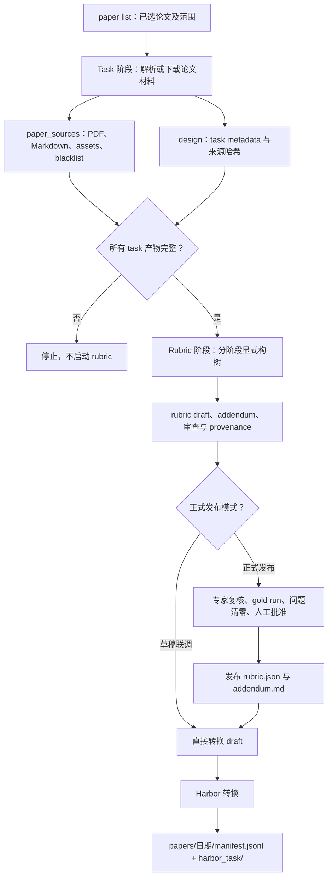
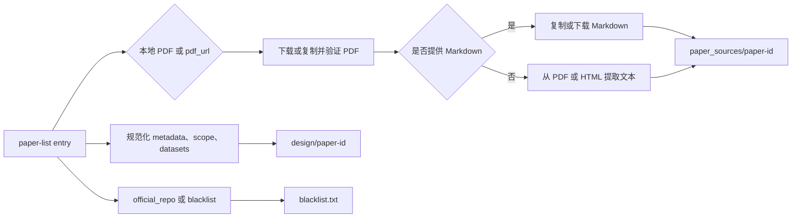
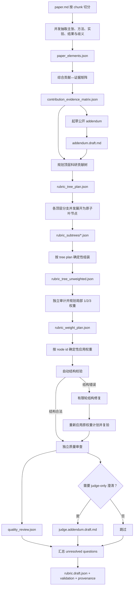

# PaperBench Factory：完整任务生产管线

本目录把已经选好的论文列表按固定顺序转换为 PaperBench task、显式树状
rubric，最后生成与 processed Harbor 数据一致的任务批次。总入口是
`factory/build_paperbench.py`，它严格执行：

```text
task 构造 → task 完整性检查 → rubric/addendum 构造 → Harbor 转换
```

Rubric 生成的是可审计初稿。初稿能够用于 Harbor 格式联调，但正式发布仍必须经过
gold run、领域专家复核、问题清零和人工批准。

## 1. 目录与数据边界

```text
Task/PaperBench/
├── factory/
│   ├── build_paperbench.py              # 严格串联三个阶段
│   ├── task/                             # 论文输入包构造
│   ├── rubrics/                          # rubric 构树、校验、发布
│   ├── harbor/                           # Harbor 格式转换
│   └── paperlist/                        # 已选论文列表
├── paper_sources/                        # task 中间输入；答题时挂载其公开部分
│   └── <paper-id>/
│       ├── config.yaml
│       ├── paper.pdf
│       ├── paper.md
│       ├── blacklist.txt
│       ├── assets/
│       ├── rubric.json                   # 仅人工批准发布后存在
│       ├── addendum.md                   # 仅人工批准发布后存在
│       └── judge.addendum.md             # 可选
├── design/                               # 数据作者侧信息，不给答题 agent
│   └── <paper-id>/
│       ├── task_metadata.json
│       ├── source_provenance.json
│       └── rubric_authoring/              # 完整 rubric 制作轨迹
├── splits/
└── papers/                               # 只放最终 Harbor 批次
    └── <YYYYMMDD-HHMMSS>/
        ├── manifest.jsonl
        └── harbor_task/
            └── <date>-research-paperbench-<6hex>/
```

一道最终题目的路径为：

```text
/root/workspace/Task/PaperBench/papers/<日期>/harbor_task/<task-id>/
```

`paper_sources/` 和 `design/` 是可恢复、可审核的中间层，`papers/` 是最终格式层。
旧的 `shared/` 不参与当前管线。

## 2. 总体流程



总入口会先完成并验证全部选中论文的 task，才进入 rubric 阶段；rubric 阶段结束后
才进入 Harbor 转换。不会为尚未构造 task 的论文先生成 rubric。

## 3. 输入 paper list

paper list 可以是 JSON 数组，也可以是带 `papers` 数组的对象。最小 URL-only
输入需要 `id`、`title` 和指向 PDF 文件的 `pdf_url`：

```json
{
  "collection_id": "my-paperbench-batch",
  "papers": [
    {
      "id": "example-paper",
      "title": "Example Paper",
      "paper_url": "https://arxiv.org/abs/0000.00000",
      "pdf_url": "https://arxiv.org/pdf/0000.00000",
      "official_repo": "https://github.com/author/repo",
      "planned_scope": "复现的任务范围",
      "primary_artifacts": ["主要结果表"],
      "datasets": []
    }
  ]
}
```

- PDF 可由 `pdf_path`、`paper_pdf` 或 `pdf_url` 提供；`pdf_url` 必须直接返回 PDF。
- Markdown 可由 `markdown_path`、`paper_md`、`markdown_url` 或 `md_url` 提供。
- 没有 Markdown 时，Factory 依次尝试 `pdftotext`、`PyMuPDF`、`pypdf`，必要时
  再使用可推导出的 HTML 页面生成可搜索文本。
- 没有 assets 时会创建合法的空 `assets/`，所以 URL-only 列表可以运行。
- `--offline` 只能使用本地文件，不能和仅有 URL 的输入搭配。
- `official_repo` 只用于生成 `blacklist.txt`；Factory 不 clone、不下载、不读取
  作者官方仓库。
- 相对路径默认相对于 paper list 所在目录，可用 `--source-root` 改写。

## 4. 一次运行完整管线

安装依赖并通过环境变量传入密钥；不要把密钥写入 paper list、README 或命令历史：

```bash
cd /root/workspace/Task/PaperBench
python3 -m pip install -r factory/requirements.txt
export OPENAI_API_KEY=...

python3 factory/build_paperbench.py \
  --paper-list factory/paperlist/20260815.json \
  --model gpt-5.5-high \
  --base-url http://your-openai-compatible-endpoint/v1 \
  --task-workers 4 \
  --paper-workers 4 \
  --workers 2 \
  --batch-id 20260817-120000
```

不传 `--paper` 时按 paper list 顺序处理全部论文；只处理部分论文时可重复传参：

```bash
python3 factory/build_paperbench.py \
  --paper-list factory/paperlist/20260815.json \
  --paper tent \
  --paper ppo \
  --model gpt-5.5-high \
  --batch-id 20260817-120000
```

按列表位置切换模型时，两组论文严格顺序执行，组内仍可并发：

```bash
python3 factory/build_paperbench.py \
  --paper-list factory/paperlist/20260815.json \
  --model gpt-5.5-high \
  --second-model deepseek-v4-flash-0731 \
  --model-switch-after 10 \
  --task-workers 4 \
  --paper-workers 4 \
  --workers 2 \
  --batch-id 20260817-120000
```

模型请求的峰值并发约为 `paper-workers × workers`。`paper-workers` 控制同时制作
多少篇论文，`workers` 控制单篇论文的分块抽取和 rubric 顶层子树展开并发。

## 5. 阶段一：Task 构造

入口：`factory/task/build_tasks.py`。



主要产物：

- `paper_sources/<id>/config.yaml`：PaperBench 的 ID 与标题。
- `paper_sources/<id>/paper.pdf`：经过 PDF magic 校验的论文原文。
- `paper_sources/<id>/paper.md`：后续模型抽取使用的文本。
- `paper_sources/<id>/assets/`：可选论文资源；允许为空。
- `paper_sources/<id>/blacklist.txt`：答题 agent 不得查看的官方实现来源。
- `design/<id>/task_metadata.json`：范围、数据集、算力和目标结果等作者侧元数据。
- `design/<id>/source_provenance.json`：来源、转换方式、页数和内容哈希。

单独执行：

```bash
python3 factory/task/build_tasks.py \
  --paper-list factory/paperlist/20260815.json \
  --output-root /root/workspace/Task/PaperBench \
  --workers 4
```

完整 task 默认跳过；`--force` 会重建选中论文的 task。总入口在进入 rubric 阶段前
还会再次检查所需文件和目录是否齐全。

## 6. 阶段二：Rubric 显式构树

入口：`factory/rubrics/create_rubrics.py`。制作规范是
`factory/rubrics/RUBRIC_CREATION_GUIDE_ZH.md`。

Rubric 不是让模型一次性生成最终 JSON，而是显式保存“抽取 → 规划 → 分支展开 →
确定性组装 → 独立配权 → 校验和审查”的全过程：



### 6.1 各步骤的职责

1. **论文元素抽取**：将长论文切块，并发抽取贡献、公式、方法组件、数据、实验、
   baseline、指标、结果定位和歧义，写入 `paper_elements.json`。
2. **贡献—证据矩阵**：跨 chunk 去重，建立“论文主张 → 需要实现什么 → 需要运行
   什么 → judge 应检查什么”的证据链。无法从论文确定的事项进入 unresolved，而不是
   猜测。
3. **公开 Addendum**：只补充完成任务所需的范围、资源约束、允许调整和证据接口；
   不泄漏 rubric 权重、隐藏容差、官方代码细节或解法目录结构。
4. **顶层树规划**：按科研成果组织分支，而不是按 `models.py`、`train.py` 等文件名
   组织。规划文件先于任何完整 rubric 产生。
5. **分支展开**：每个顶层分支独立展开，直至每个叶节点可以二元判断且只表达一个
   原子要求；分支结果逐文件保存在 `rubric_subtrees/`。
6. **确定性组装**：代码按计划顺序拼接分支，生成显式的未最终配权树，避免模型在
   合并时悄悄改写或丢失分支。
7. **独立配权**：模型只输出覆盖全部 node ID 的权重计划；代码验证 ID 和权重后再
   应用。科研重要性决定权重，不以实现工作量或分支节点数量决定权重。
8. **自动校验和修复**：检查字段契约、ID 唯一性、叶子类别、内部节点类别、权重、
   深度和有效权重总和。只有结构错误才进入有限轮修复，之后会重新应用和审计权重。
9. **独立质量审查**：检查范围、原子性、证据可观察性、重复计分、结果容差、
   addendum/rubric 职责和全局有效权重平衡。
10. **落盘审计轨迹**：汇总 unresolved questions、校验报告、生成模型、输入哈希、
    guide 哈希和构树阶段，最终状态固定为 `draft-needs-human-review`。

### 6.2 树节点与权重语义

每个节点严格包含：

```json
{
  "id": "unique-kebab-case-id",
  "requirements": "单一、可观察、可二元判断的要求",
  "weight": 1,
  "sub_tasks": [],
  "task_category": "Code Development",
  "finegrained_task_category": "Method Implementation"
}
```

- 内部节点的两个 category 必须为 `null`；叶节点必须使用官方 category。
- 根节点权重固定为 `1`，其余节点使用局部 `1/2/3` 权重。
- 权重只在同一父节点的直接子节点间比较。
- 叶节点全局有效权重为沿根到叶路径上各层“本节点权重 / 同级权重和”的乘积。
- 一棵树全部叶节点的有效权重之和必须为 `1`。
- 原始 PaperBench `TaskNode` 没有 `depends_on`，当前格式通过子节点顺序表达依赖。

### 6.3 Rubric authoring 产物

```text
design/<paper-id>/rubric_authoring/
├── paper_elements.json
├── contribution_evidence_matrix.json
├── addendum_generation.json
├── addendum.draft.md
├── rubric_tree_plan.json
├── rubric_subtrees/*.json
├── rubric_tree_unweighted.json
├── rubric_weight_plan.json
├── rubric_weight_application.json
├── rubric_generation.json
├── rubric.draft.json
├── quality_review.json
├── unresolved_questions.json
├── validation_report.json
├── judge_addendum_generation.json       # 按需存在
├── judge.addendum.draft.md              # 按需存在
└── authoring_provenance.json
```

单独生成 rubric：

```bash
python3 factory/rubrics/create_rubrics.py \
  --root /root/workspace/Task/PaperBench \
  --paper tent \
  --model gpt-5.5-high \
  --base-url http://your-openai-compatible-endpoint/v1 \
  --paper-workers 1 \
  --workers 3 \
  --target-leaves 40-120
```

`--resume` 会跳过拥有完整 authoring 产物的论文；对中断留下的不完整 authoring
目录，它会删除该不完整目录并从该论文开头重新生成。`--overwrite` 会显式重建已有
完整草稿，两者不能同时使用。

## 7. 人工审核与发布门槛

自动结构合法不等于 rubric 已可正式发布。人工审核至少要完成：

1. 逐项核对 contribution-evidence matrix 的论文来源和核心贡献覆盖；
2. 用 gold run 确定范围、资源、指标、容差和缩小实验是否现实；
3. 处理 `quality_review.json` 的全部 `blocking_issues`；
4. 处理并清空 `unresolved_questions.json`；
5. 检查叶节点是否原子、是否可从代码/执行/结果证据观察、是否重复计分；
6. 检查全局有效权重，避免树深或叶子数量意外稀释核心贡献；
7. 使用完整实现、只写代码未运行、明显缺陷三类提交校准，并由至少两位评分者复核。

重新校验人工编辑后的草稿：

```bash
python3 factory/rubrics/validate_rubric.py \
  design/tent/rubric_authoring/rubric.draft.json \
  --report design/tent/rubric_authoring/validation_report.manual.json
```

全部问题解决后发布：

```bash
python3 factory/rubrics/publish_rubric.py \
  --paper tent \
  --approved-by reviewer-name \
  --notes "gold run and independent review completed"
```

发布脚本在以下任一情况存在时拒绝发布：结构错误、addendum TODO、未解决问题、
review blocker、权重计划未完整应用。发布后会把 `rubric.json`、`addendum.md` 和可选
judge addendum 写入 `paper_sources/<id>/`，并记录 `human_approval.json` 及内容哈希。

## 8. 阶段三：Harbor 转换

入口：`factory/harbor/convert_to_harbor.py`。目标格式对齐：

```text
/mnt/shared-storage-user/songdemin/user/yangzhixiong/agent_training/
  tasks_processed/20260807-162700
```

每道成品题包含：

```text
<task-id>/
├── task.toml
├── instruction.md
├── resource_metadata.json
├── environment/paper/
│   ├── paper.pdf
│   ├── paper.md
│   ├── addendum.md
│   ├── blacklist.txt
│   └── assets/
├── tests/
│   ├── test.sh
│   ├── llm_rubric_judge.py
│   ├── judge_config.json
│   ├── rubric.json
│   └── judge.addendum.md
└── solution/
    ├── reproduce.sh
    └── README.md
```

Factory 在仓库中固定保存官方 PaperBench instructions 原文，其 SHA-256 为：

```text
712ed3968de5b8d98b96e25e7d33c95552c460649201743d8535e84c344bac56
```

输出 `instruction.md` 只把官方原文中的 `NVIDIA A10 GPU` 确定性替换为实际
`NVIDIA H200 GPU`；其余文字保持不变，包括 `/home/paper`、`/home/submission` 和
“最多运行 7 天”。Task、Artifact 和 verifier 也统一使用这套 `/home` 路径，默认
reproduction timeout 为 604800 秒。`task.toml` 不写入 API key/base URL 占位符；
verifier 运行时由 Harbor 安全注入 `JUDGE_LLM_API_KEY` 与 `JUDGE_LLM_BASE_URL`。

Judge 模板保存在 `factory/harbor/templates/`，不再依赖可能被热修的共享参考题。它不向
gpt-5.5 上游发送 temperature，按 README/reproduce/结果/源码优先收集提交文件，并且
超时后不会无条件重发同一个大请求。详细契约见
[`factory/harbor/README.md`](harbor/README.md)。

单独转换已有 task 和 rubric：

```bash
python3 factory/harbor/convert_to_harbor.py \
  --root /root/workspace/Task/PaperBench \
  --paper-list factory/paperlist/20260815.json \
  --paper tent \
  --batch-id 20260817-120000 \
  --output-parent /root/workspace/Task/PaperBench/papers
```

默认优先使用已经发布的 `paper_sources/<id>/rubric.json` 和 `addendum.md`；不存在时
会使用 authoring draft，方便格式联调。正式数据集转换必须增加 `--require-approved`。
相同批次目录默认拒绝覆盖，只有显式 `--overwrite` 才会替换。

## 9. 中断恢复与常用参数

| 参数 | 阶段 | 含义 |
|---|---|---|
| `--paper ID` | 全部 | 只选择指定论文；可重复 |
| `--offline` | Task | 禁止联网，只使用本地输入 |
| `--force-task` | Task | 重建已存在的 task 包 |
| `--task-workers N` | Task | 同时下载、转换多少篇论文，默认 4 |
| `--paper-workers N` | Rubric | 同时制作多少篇 rubric，默认 1 |
| `--workers N` | Rubric | 单篇内部的 chunk/子树并发，默认 3 |
| `--target-leaves 40-120` | Rubric | 原子叶节点粒度目标，不机械凑数 |
| `--repair-rounds N` | Rubric | 自动结构错误最大修复轮数 |
| `--resume-rubric` | Rubric | 跳过完整项，重新开始中断的不完整项 |
| `--overwrite-rubric` | Rubric | 重建已有完整草稿 |
| `--second-model MODEL` | Rubric | 切换位置之后使用的第二模型 |
| `--model-switch-after N` | Rubric | 前 N 篇用主模型，其余用第二模型 |
| `--batch-id DATE` | Harbor | 设置最终日期批次目录名 |
| `--harbor-reproduction-timeout-sec N` | Harbor | `reproduce.sh` verifier 时限，默认 604800（7 天） |
| `--harbor-judge-request-timeout-sec N` | Harbor | 单次 judge 请求时限，默认 600；超时不盲重试 |
| `--require-approved` | Harbor | 禁止未人工批准的 draft 进入批次 |
| `--overwrite-harbor` | Harbor | 替换同名的未完成或旧批次 |

恢复完整管线时通常使用：

```bash
python3 factory/build_paperbench.py \
  --paper-list factory/paperlist/20260815.json \
  --model gpt-5.5-high \
  --resume-rubric \
  --batch-id 20260817-120000
```

如果少数论文持续失败，可以只把已有完整 `authoring_provenance.json` 且完整 authoring
文件齐全的论文 ID 传给 Harbor 转换器；不完整论文不会自动视为完成。

## 10. 批次 `20260817-113752` Rubric 统计

统计范围是最终批次
`papers/20260817-113752/manifest.jsonl` 中的 17 篇论文，对应
`design/<paper-id>/rubric_authoring/rubric.draft.json`。深度口径为根节点深度 0；
“nodes”包含根、内部节点和叶节点。

### 10.1 总览

| 指标 | 统计值 |
|---|---:|
| 论文 / rubric 树 | 17 |
| 全部节点 | 1,709 |
| 内部节点（含 root） | 492 |
| 原子叶节点 | 1,217 |
| 单题节点数 | 平均 100.53；中位数 104；范围 67–139 |
| 单题叶节点数 | 平均 71.59；中位数 73；范围 45–99 |
| 单题顶层分支数 | 平均 6.12；中位数 6；范围 4–9 |
| 最大树深 | 3 或 4；平均 3.59 |
| 内部节点直接子节点数 | 平均 3.44；中位数 3；范围 1–9 |
| 只有一个子节点的内部节点 | 11 |
| 自动结构校验错误 | 0 |
| 自动校验警告 | 514 |
| 独立质量审查 blockers | 105 |
| unresolved questions | 966 |
| 生成模型 | `gpt-5.5-high` 10 篇；`deepseek-v4-flash-0731` 7 篇 |

节点深度分布：

| 深度 | 节点数 |
|---:|---:|
| 0 | 17 |
| 1 | 104 |
| 2 | 328 |
| 3 | 1,125 |
| 4 | 135 |

叶节点官方类别分布：

| task category | 叶节点数 | 占比 |
|---|---:|---:|
| Code Development | 546 | 44.86% |
| Code Execution | 334 | 27.44% |
| Result Analysis | 337 | 27.69% |

叶节点细分类别分布：

| fine-grained category | 叶节点数 | 占比 |
|---|---:|---:|
| Evaluation, Metrics & Benchmarking | 402 | 33.03% |
| Method Implementation | 357 | 29.33% |
| Experimental Setup | 225 | 18.49% |
| Logging, Analysis & Presentation | 160 | 13.15% |
| Data Processing & Preparation | 43 | 3.53% |
| Environment & Infrastructure Setup | 21 | 1.73% |
| Dataset and Model Acquisition | 9 | 0.74% |

全部节点的局部权重分布为：权重 1 有 293 个，权重 2 有 734 个，权重 3 有
682 个。1,217 个叶节点的全局有效权重最小 0.1852%、中位数 1.2054%、最大
5.5556%；没有叶节点低于 0.1%。这里的平均有效权重跨 17 棵树计算为 1.3969%，
每棵树内部的叶节点有效权重之和均为 100%。

### 10.2 每题规模

| paper | nodes | internal | leaves | max depth | top branches | warnings | blockers | unresolved |
|---|---:|---:|---:|---:|---:|---:|---:|---:|
| fb-representations | 108 | 35 | 73 | 4 | 6 | 24 | 5 | 52 |
| unlikelihood-training | 90 | 22 | 68 | 3 | 5 | 35 | 6 | 61 |
| transferring-gans | 132 | 34 | 98 | 3 | 8 | 40 | 5 | 51 |
| tent | 107 | 29 | 78 | 4 | 7 | 26 | 6 | 60 |
| gsdm | 135 | 39 | 96 | 4 | 9 | 50 | 8 | 47 |
| sequential-neural-likelihood | 104 | 30 | 74 | 4 | 6 | 28 | 6 | 63 |
| free-adversarial-training | 99 | 28 | 71 | 4 | 6 | 23 | 5 | 51 |
| example-forgetting | 92 | 30 | 62 | 4 | 4 | 18 | 8 | 50 |
| pinns-ntk | 108 | 26 | 82 | 3 | 6 | 34 | 3 | 52 |
| gedi | 117 | 39 | 78 | 4 | 7 | 38 | 3 | 44 |
| adalora | 68 | 18 | 50 | 3 | 4 | 18 | 6 | 58 |
| ppo | 77 | 21 | 56 | 3 | 5 | 22 | 8 | 60 |
| agreement-on-the-line | 67 | 22 | 45 | 4 | 5 | 30 | 7 | 60 |
| conditional-flow-matching | 139 | 40 | 99 | 4 | 8 | 54 | 7 | 69 |
| reflexion | 68 | 22 | 46 | 3 | 5 | 14 | 10 | 66 |
| bilevel-coresets | 91 | 26 | 65 | 3 | 6 | 25 | 5 | 53 |
| gsm-vi | 107 | 31 | 76 | 4 | 7 | 35 | 7 | 69 |

17 棵树的结构校验错误均为 0，因此可以被 Harbor 转换器读取；但警告、blocker 和
unresolved 数量表明它们仍是初稿，不能把“成功转换为 Harbor”解释为“rubric 已经
专家批准”。

## 11. 验证

运行 Factory 单测：

```bash
python3 -B -m unittest discover -s factory/tests -v
```

检查一个已发布 PaperBench 包：

```bash
python3 factory/rubrics/validate_rubric.py --paper tent --packages
```

检查最终批次时，应至少确认：

- `manifest.jsonl` 行数等于 `harbor_task/` 子目录数；
- 每个 manifest `paper_id` 都来自本次明确选择的论文；
- 每题所需环境、tests 和 solution 文件齐全；
- 每份 `instruction.md` 除 `A10 → H200` 外都与固定官方原文一致；
- task、Artifact、instruction 和 verifier 路径统一为 `/home/paper`、`/home/submission`；
- `task.toml` 不含 LLM/JUDGE secret 占位符，judge 只读取运行时注入的 `JUDGE_LLM_*`；
- 正式发布批次全部通过 `--require-approved`。
