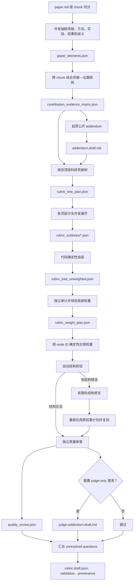

# PaperBench Rubric Factory 中文说明

本目录负责把已经构造好的 PaperBench task 转换为可审计的树状 rubric、公开
addendum 和可选的 judge addendum。实现遵循
[RUBRIC_CREATION_GUIDE_ZH.md](RUBRIC_CREATION_GUIDE_ZH.md)。

这里最重要的约束是：**rubric 必须显式、分阶段构树，不能让模型一次性直接输出最终
rubric**。树规划、各分支展开、确定性组装、独立配权、权重应用、结构校验和质量审查
都会分别落盘。

模型产物默认是 `draft-needs-human-review`。自动校验通过只说明 JSON 树结构合法，
不代表 rubric 已经过 gold run、领域专家审核或正式批准。

## 1. 输入、输出与可见性边界

每篇论文至少需要以下输入：

```text
paper_sources/<paper-id>/paper.md
design/<paper-id>/task_metadata.json
factory/rubrics/RUBRIC_CREATION_GUIDE_ZH.md
```

- `paper.md` 提供论文正文；由 Task Factory 从给定 Markdown、PDF 或 HTML 生成。
- `task_metadata.json` 提供数据作者选定的范围、主要产物、数据集、算力等信息。
- guide 固定 rubric 的设计原则、类别、树结构、证据和审核标准。

所有模型生成中间物写入：

```text
design/<paper-id>/rubric_authoring/
```

`design/` 是数据作者侧目录，不能挂载给答题 agent。正式人工批准后，发布脚本才会把
最终 `rubric.json`、`addendum.md` 和可选 `judge.addendum.md` 写入
`paper_sources/<paper-id>/`。

## 2. 显式构树全流程



### 2.1 论文元素抽取

`paper.md` 按 `--chunk-chars` 切块。不同 chunk 可通过 `--workers` 并发处理，抽取：

- 论文明确声称的贡献；
- 方法模块、公式、算法和训练目标；
- 数据集、划分、预处理、模型和超参数；
- 主实验、baseline、消融、指标和统计方法；
- 支撑结论的表格、图、章节和附录定位；
- 论文没有说清、需要专家或 gold run 决定的歧义。

输出 `paper_elements.json`。此阶段只做有来源的抽取，不编造数值容差、资源预算或
未公开实现细节。

### 2.2 贡献—证据矩阵

模型跨 chunk 去重并建立：

```text
论文主张 → 需要实现什么 → 需要执行什么 → judge 检查什么证据
```

输出 `contribution_evidence_matrix.json`。每个准备评分的核心结论都应同时有实现、
执行和结果证据；不能从论文确认的内容进入 unresolved questions。

### 2.3 公开 Addendum

根据 task metadata 和贡献—证据矩阵起草 `addendum.draft.md`，用于公开说明：

- 复现范围和排除项；
- 数据集版本、划分和允许的替代资源；
- 必做实验、baseline 和输出证据；
- 算力受限时允许的缩小实验；
- 指标定义、随机种子、重复次数和预先确定的容差；
- 必须由 `reproduce.sh` 生成的文件。

公开 addendum 不能泄漏局部权重、隐藏 judge 规则、官方实现细节或推荐解法目录结构。

### 2.4 顶层树规划

`rubric_tree_plan.json` 先定义顶层科研贡献分支，再生成任何完整 rubric。顶层分支应按
研究成果组织，例如方法、主实验、关键消融和结果证据，而不是按 `models.py`、
`train.py` 等文件名组织。

每个分支包含唯一 kebab-case ID、要求、初始局部权重、覆盖的论文贡献和预期叶节点
数量。代码会先校验 plan，再进入子树生成。

### 2.5 分支并发展开

每个顶层分支独立生成一个 `rubric_subtrees/<branch-id>.json`。展开目标是原子叶节点：

- 一个叶节点只表达一个可独立成功或失败的条件；
- judge 能从代码、真实运行或生成结果中观察它；
- 不依赖 README 自述作为实现证据；
- 不把实现、执行和结果三个阶段揉成一个节点；
- 不重复评分同一贡献；
- 不将特定文件布局误当成唯一正确实现。

`--target-leaves 40-120` 是粒度目标而不是硬凑数量。简单论文可以更少，复杂论文可以
在合理范围内更多。

### 2.6 确定性组装

代码按 tree plan 中的分支顺序组装已生成的子树，输出
`rubric_tree_unweighted.json`。组装由代码完成而不是再次请求模型，避免合并过程悄悄
改写、遗漏或重复分支。

### 2.7 独立权重规划与应用

模型在完整树已经确定后单独生成 `rubric_weight_plan.json`。计划必须覆盖树中全部
node ID，只允许局部整数权重 `1/2/3`，根节点固定为 `1`。

权重反映科研重要性，不反映开发工作量。一个父节点下只比较其直接子节点，不能因为
某分支叶节点多就自动获得更高全局占比。

代码验证以下条件后，按 node ID 应用权重并输出
`rubric_weight_application.json`：

- 没有未知 ID；
- 没有重复 ID；
- 没有遗漏节点，或明确记录保留的初始权重；
- 权重只属于 `1/2/3`；
- root 仍为 `1`。

### 2.8 自动校验和有限修复

`validate_rubric` 会递归检查：

- 每个节点字段精确且完整；
- ID 唯一、非空并符合 kebab-case；
- requirements 非空；
- `sub_tasks` 类型正确；
- 内部节点 category 为 `null`；
- 叶节点使用官方 task category 和 fine-grained category；
- 每组兄弟权重可归一化；
- 全部叶节点全局有效权重之和为 `1`；
- 深度、单子节点、复合要求和模糊结果容差等警告。

只有出现结构错误时才进入 `--repair-rounds` 控制的有限修复。修复后会重新应用原权重
计划并再次校验，避免修复过程绕过独立配权阶段。

### 2.9 独立质量审查

结构合法后再做独立语义审查，输出 `quality_review.json`。审查范围包括：

- 核心贡献和正文主结果是否覆盖；
- 叶节点是否真正原子、可观察、可在目标时间内判定；
- 是否存在重复计分、实现绑定或证据链断裂；
- addendum 与 rubric 的职责是否混淆；
- 结果规则是否凭空发明容差；
- 深层树是否稀释重要叶节点；
- 是否需要不公开给 agent 的 judge addendum。

`blocking_issues` 不为空时，初稿不能正式发布。

### 2.10 汇总与 provenance

最后汇总所有阶段产生的 unresolved questions，落盘：

- `rubric.draft.json`；
- `quality_review.json`；
- `unresolved_questions.json`；
- `validation_report.json`；
- `authoring_provenance.json`。

Provenance 记录论文 ID、模型、paper/task metadata/guide 哈希、chunk 数量、显式构树
阶段、目标叶节点范围和修复轮数。状态固定为 `draft-needs-human-review`。

## 3. 节点格式和权重语义

每个节点严格包含六个字段：

```json
{
  "id": "unique-kebab-case-id",
  "requirements": "一个可观察、可二元判断的要求",
  "weight": 2,
  "sub_tasks": [],
  "task_category": "Code Development",
  "finegrained_task_category": "Method Implementation"
}
```

内部节点的两个 category 必须为 `null`。叶节点的 `task_category` 只能是：

- `Code Development`：实现、配置、数据处理和评测逻辑；
- `Code Execution`：代码真实运行、覆盖所需实验并生成证据；
- `Result Analysis`：结果文件和数值、排序、趋势或定性结论支持论文主张。

Fine-grained category 只能从代码定义的官方集合中选择。

### 3.1 局部权重

权重只在同一个父节点的直接子节点之间比较。若父节点的三个子节点权重是
`3、2、1`，它们分别获得父节点有效权重的 `3/6、2/6、1/6`。

### 3.2 全局有效权重

叶节点的全局有效权重是从根到叶路径上各层局部占比的乘积：

```text
effective(leaf) = Π(node.weight / sum(sibling weights))
```

一棵合法树的全部叶节点有效权重之和必须为 `1`。人工审核必须检查核心贡献是否因树
过深而被意外稀释。

## 4. Authoring 目录

```text
design/<paper-id>/rubric_authoring/
├── paper_elements.json
├── contribution_evidence_matrix.json
├── addendum_generation.json
├── addendum.draft.md
├── rubric_tree_plan.json
├── rubric_subtrees/*.json
├── rubric_tree_unweighted.json
├── rubric_weight_plan.json
├── rubric_weight_application.json
├── rubric_generation.json
├── rubric.draft.json
├── quality_review.json
├── unresolved_questions.json
├── validation_report.json
├── judge_addendum_generation.json       # 按需存在
├── judge.addendum.draft.md              # 按需存在
└── authoring_provenance.json
```

完整目录中的每一层都应保留。不要只保留最终 `rubric.draft.json`，否则无法审计模型如何
从论文主张得到顶层树、原子叶节点和权重。

## 5. 生成命令

### 5.1 单篇论文

```bash
cd /root/workspace/Task/PaperBench
export OPENAI_API_KEY=...

python3 factory/rubrics/create_rubrics.py \
  --root /root/workspace/Task/PaperBench \
  --paper tent \
  --model your-model \
  --base-url https://your-openai-compatible-endpoint/v1 \
  --workers 3 \
  --target-leaves 40-120
```

密钥只通过环境变量传递，不能写入命令、paper list、日志或仓库。

### 5.2 多篇并发

```bash
python3 factory/rubrics/create_rubrics.py \
  --paper tent \
  --paper ppo \
  --paper adalora \
  --model your-model \
  --paper-workers 3 \
  --workers 2
```

- `--paper-workers`：同时制作多少篇论文；
- `--workers`：单篇论文内部的 chunk 抽取和顶层子树并发；
- 模型请求峰值约为 `paper-workers × workers`。

增大并发前需要确认模型端点的 QPS、并发连接、token 限额和超时策略。

### 5.3 使用总入口和模型切换

推荐通过完整管线入口保证 task 先于 rubric：

```bash
python3 factory/build_paperbench.py \
  --paper-list factory/paperlist/20260815.json \
  --model primary-model \
  --second-model secondary-model \
  --model-switch-after 10 \
  --paper-workers 4 \
  --workers 2 \
  --batch-id 20260818-120000
```

前 10 篇使用主模型，其余论文使用第二模型。两组严格顺序执行，组内按照
`--paper-workers` 并发。

## 6. 中断恢复与覆盖

```bash
python3 factory/rubrics/create_rubrics.py \
  --paper tent \
  --paper ppo \
  --model your-model \
  --resume
```

`--resume` 的语义：

- authoring 必需文件完整：跳过该论文；
- authoring 目录不完整：删除该不完整目录，从该论文开头重新生成；
- 不会从某个模型调用的中间 token 位置继续。

`--overwrite` 会删除并重建已有完整草稿，可能覆盖人工编辑。`--resume` 与
`--overwrite` 互斥。

模型请求还可通过以下参数控制：

| 参数 | 默认值 | 作用 |
|---|---:|---|
| `--chunk-chars` | 50000 | 论文切块长度 |
| `--workers` | 3 | 单篇内部并发 |
| `--paper-workers` | 1 | 论文级并发 |
| `--target-leaves` | 40-120 | 原子叶节点粒度目标 |
| `--repair-rounds` | 1 | 自动结构修复上限 |
| `--max-completion-tokens` | 24000 | 单次模型输出上限 |
| `--timeout` | 300 | 单请求超时秒数 |
| `--retries` | 4 | 请求重试次数 |

## 7. 离线测试与 mock responses

`--mock-responses-dir DIR` 可让脚本从本地 JSON 读取各阶段响应，不访问模型端点。文件名
为 `<paper-id>.<stage>.json`，常见 stage：

- `elements-001`；
- `matrix`；
- `addendum`；
- `tree-plan`；
- `subtree-<branch-id>`；
- `weighting`；
- `review`；
- `repair-01`；
- `judge-addendum`。

Factory 端到端测试使用该机制验证显式构树顺序、目录产物和 Harbor 转换。

## 8. 人工审核

人工审核至少完成：

1. 核对 contribution-evidence matrix 中每项论文定位；
2. 确认摘要、引言和正文主实验的核心贡献都被覆盖；
3. 用 gold run 验证数据、环境、算力、执行入口和输出证据；
4. 在查看候选提交前冻结数值容差和代理实验规则；
5. 处理全部 `quality_review.json` blocking issues；
6. 处理并清空 `unresolved_questions.json`；
7. 检查叶节点原子性、可观察性、重复计分和实现绑定；
8. 检查全部叶节点的全局有效权重；
9. 使用完整提交、只实现未执行提交、明显缺陷提交进行校准；
10. 至少两位评分者独立评分并处理分歧。

人工修改后重新校验：

```bash
python3 factory/rubrics/validate_rubric.py \
  design/tent/rubric_authoring/rubric.draft.json \
  --report design/tent/rubric_authoring/validation_report.manual.json
```

警告可以由人工判断接受，但决定和理由应保留在审核记录中。结构错误不能忽略。

## 9. 人工批准与发布

解决问题并完成审核后执行：

```bash
python3 factory/rubrics/publish_rubric.py \
  --paper tent \
  --approved-by reviewer-name \
  --notes "gold run and independent review completed"
```

发布脚本在以下任一条件成立时拒绝发布：

- rubric 仍有结构错误；
- addendum 含 TODO/TBD；
- `quality_review.json` 仍有 blocking issues；
- `unresolved_questions.json` 不为空；
- 权重计划没有完整、合法地应用。

成功后写入：

```text
paper_sources/<paper-id>/rubric.json
paper_sources/<paper-id>/addendum.md
paper_sources/<paper-id>/judge.addendum.md      # 可选
design/<paper-id>/rubric_authoring/human_approval.json
```

`human_approval.json` 记录审核者、时间、说明、内容哈希、rubric 统计和已复核警告。已有
正式文件不会静默覆盖；更新正式版本必须显式使用 `--replace`。

发布后检查完整包：

```bash
python3 factory/rubrics/validate_rubric.py --paper tent --packages
```

## 10. Draft 与正式发布的区别

| 状态 | 结构校验 | blocker / unresolved | gold run / 专家批准 | 用途 |
|---|---|---|---|---|
| Authoring draft | 应通过 | 可能存在 | 未必完成 | 审核、统计、Harbor 格式联调 |
| Human-approved rubric | 必须通过 | 必须清零 | 必须完成 | 正式 benchmark 发布 |

Harbor 转换器默认允许读取 draft，目的是检查最终任务格式。正式生成数据集时必须使用：

```bash
python3 factory/harbor/convert_to_harbor.py ... --require-approved
```

成功打包成 Harbor 任务不等于 rubric 已经正式批准。

## 11. 当前批次示例

批次 `20260817-113752` 成功生成 17 棵 draft rubric 树：

- 全部节点：1,709；
- 内部节点：492；
- 原子叶节点：1,217；
- 自动结构错误：0；
- `gpt-5.5-high` 生成 10 篇；
- `deepseek-v4-flash-0731` 生成 7 篇。

该批次仍存在自动警告、quality review blockers 和 unresolved questions，因此属于格式
可用、尚待人工审核的 draft。完整逐题统计见上级
[Factory README](../README.md#10-批次-20260817-113752-rubric-统计)。

## 12. 测试

从仓库根目录运行：

```bash
python3 -B -m unittest discover -s factory/tests -v
```

测试覆盖：

- 离线 task 构造；
- mock 模型驱动的显式 rubric 构树；
- 重复 ID 和非法内部节点类别检测；
- 合法树与全局有效权重计算；
- Harbor 任务格式转换。
